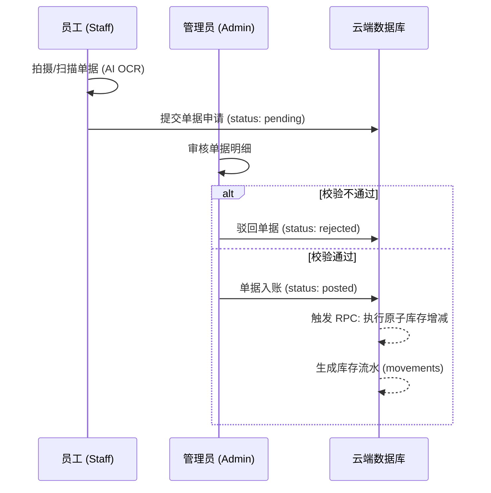

# 鑫威库存管理系统 v2.8 关键业务流程图

## 1. 入/出库闭环流程 (Audit Chain)
*本系统采用“录入-待审-入账”三段式架构，确保数据可溯源且具备法律效力。*

## 2. 财务级红冲对冲流程 (Reversal)
*严禁物理删除已生效单据。*

1.  **触发**：管理员在已入账单据详情中点击“红冲作废”。
2.  **验证**：系统校验单据状态是否为 `posted` 且未被红冲过（幂等性）。
3.  **对冲**：
    *   生成新单据 `REversal-{原单号}`。
    *   明细数量置为**负值**。
    *   库存执行反向补偿操作。
4.  **标记**：原单据标记为 `voided`，备注中写入对冲凭证号。
